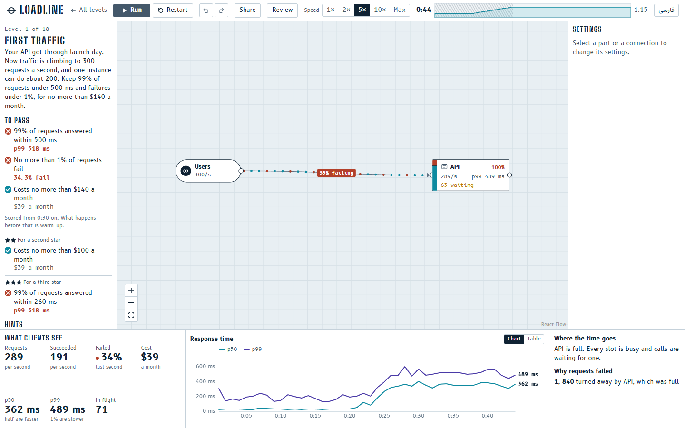
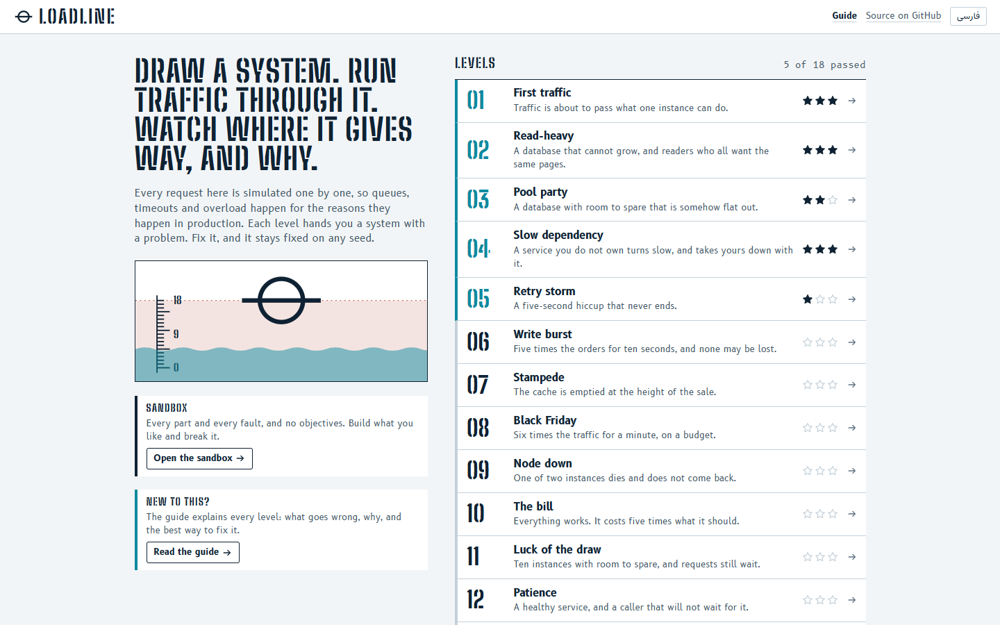
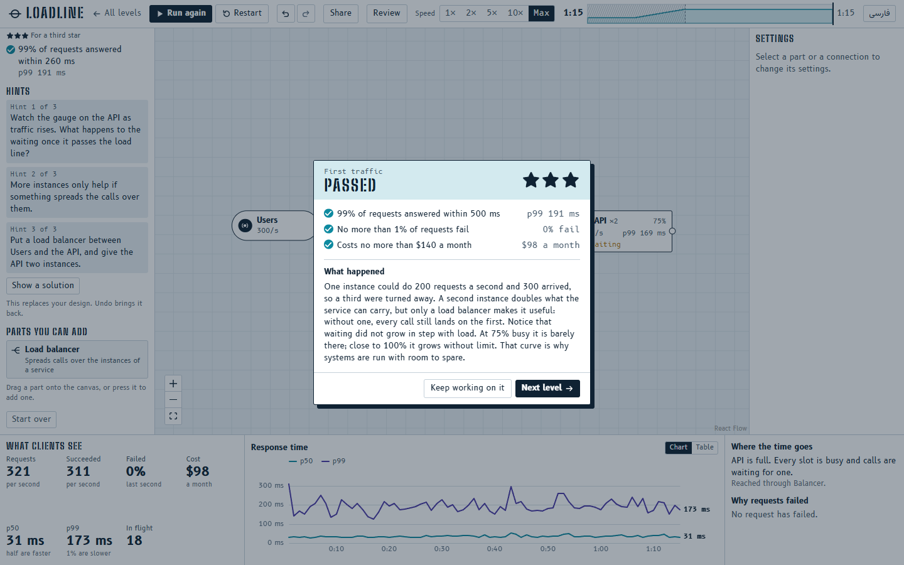
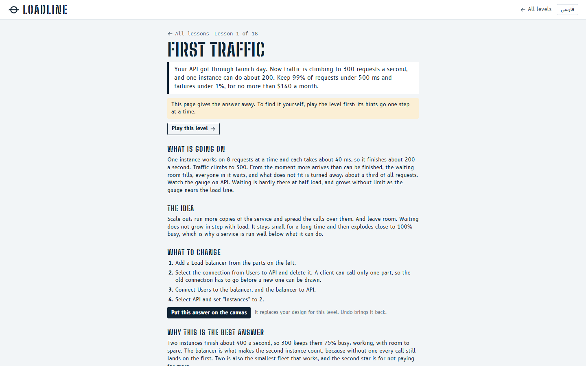
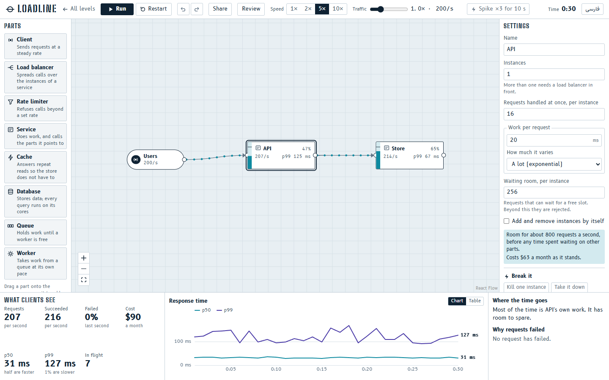
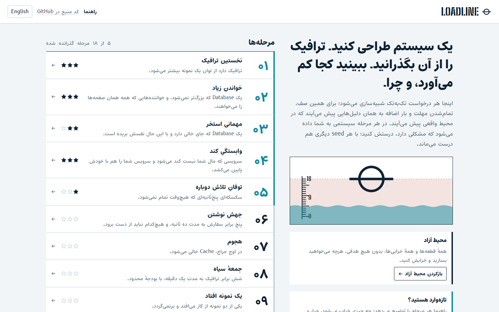
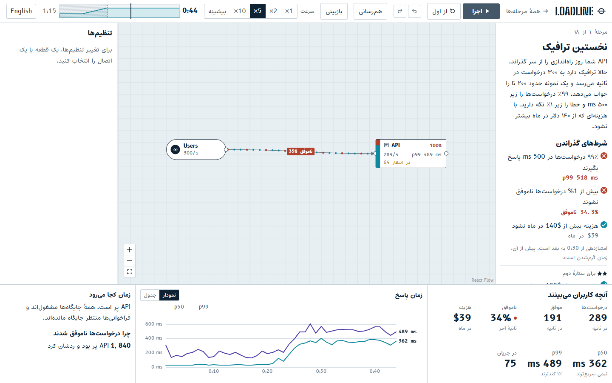
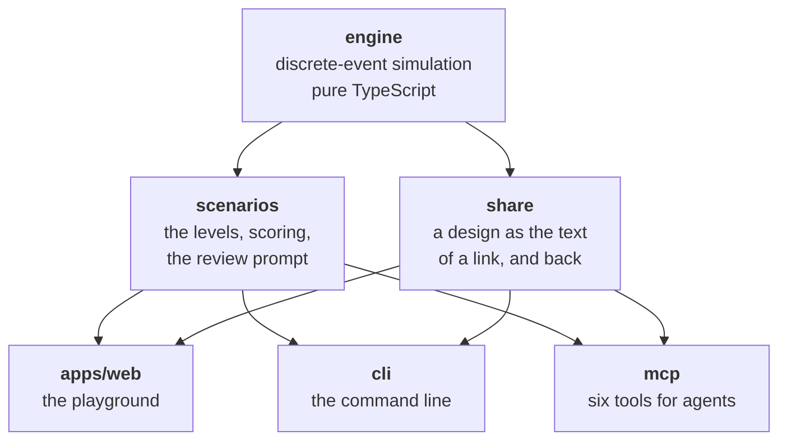
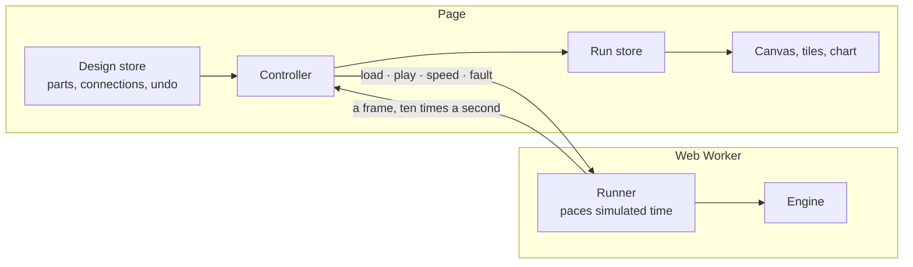

# Loadline

A system design playground. Draw an architecture, run traffic through it, break it, and see why it
broke.

**Play it at <https://amirehsank.github.io/Loadline/>.** Nothing to install, and no account.



Loadline simulates every request, one by one, as it passes through load balancers, services,
caches, databases and queues. No failure is scripted. Waiting that explodes near full load, retry
storms, cache stampedes and starved connection pools come out of queues, timeouts and retries, for
the reasons they happen in production.

The name is the mark on a ship's hull that shows how much it can safely carry. Every part on the
canvas has a gauge with the same mark.

## What it is built around

Drag-and-simulate sandboxes are not new. This one tries to do the unglamorous parts properly.

- **The numbers are checked.** The engine reproduces the textbook answers for M/M/1, M/M/c, M/M/1/K
  and M/D/1 queues to within sampling error. A soak test builds random systems, throws random
  faults at them, and checks that every request is accounted for.
- **A run can be repeated.** The same design, traffic and seed give the same report, bit for bit. A
  share link carries all three, so whoever opens it sees the numbers you saw.
- **One engine, three ways in.** The same code runs in a Web Worker behind the canvas, at the
  command line, and behind an MCP server for agents. One function scores a level in all three.
- **Eighteen levels, each teaching one thing.** Each ships with a reference answer. CI proves on five
  seeds that the design a level starts from fails and that the reference earns three stars.
- **No backend.** It is a static site. Designs live in your browser and in links, and nothing is
  uploaded.
- **English and Persian**, with the layout mirrored for Persian.

## Run it

It is hosted at the address above. To run your own copy:

```bash
git clone https://github.com/AmirehsanK/Loadline.git
cd Loadline
npm ci
npm run dev -w @loadline/web
```

Then open <http://localhost:5183>. It needs Node 22.18 or newer, because the packages run as
TypeScript with no build step between them. It is developed on Node 26.

## Playing

| | |
|---|---|
|  |  |

A level hands you a system with a problem, the traffic it has to survive, and what counts as
surviving: a p99, an error rate, a monthly cost. You change the design, press Run, and watch. The
gauge on each part fills as it gets busy. Calls travel along the connections as dots, and the red
ones failed. The panel at the bottom says where the time is going and why requests failed.

Passing earns one star. The other two are for a better answer to the same lesson, not for a
different trick. There are three hints if you want them and, after the third, a solution.

**The guide** is for anyone who would rather be shown, or who is stuck. It says how to read the
screen and what the words mean, and has a lesson on every level: what is going wrong, the idea
that fixes it and the name it goes by elsewhere, what to change step by step, why that is the best
answer, and what else people try and what comes of it. The answer is run and scored on the page,
and one button puts it on the canvas so you can watch it work. `npm run lessons` follows the steps
of every lesson in the editor, in a real browser, and checks that each earns three stars.



| # | Level | What it teaches |
|---|---|---|
| 1 | First traffic | Horizontal scaling, and why waiting explodes near full utilization |
| 2 | Read-heavy | A cache in front of a store that cannot grow; a few items get most of the traffic |
| 3 | Pool party | Connection pools: too many queries at once make a database slower, not busier |
| 4 | Slow dependency | Timeouts and circuit breakers; a breaker counts failures, not slowness |
| 5 | Retry storm | Retries multiply load; what ends a storm is less work |
| 6 | Write burst | Queues and workers: store now, do later, and size for the catch-up |
| 7 | Stampede | Surviving a cache flush at peak: fetch each item once |
| 8 | Black Friday | Autoscaling is late; headroom buys time, under a budget |
| 9 | Node down | One more instance than the load needs, health checks, and a retry |
| 10 | The bill | Sizing every part to its load line while holding the objectives |
| 11 | Luck of the draw | How a balancer picks an instance: looking at two beats picking one blind |
| 12 | Patience | A timeout shorter than a healthy answer; set it from the slow end, not the average |
| 13 | Full house | Rate limiting: turn the excess away at the door, a little under what you can serve |
| 14 | Never twice | Read replicas, for reads that never repeat and a cache cannot help |
| 15 | Clockwork | Items stored together expire together; randomise their lifetimes |
| 16 | Nine times | Retries multiply down a chain of calls; retry in one layer |
| 17 | Wrong suspect | Finding the bottleneck: the part that hurts is not always the part that is short |
| 18 | Failover | A replica for reads, a queue for writes, and a worker that waits between tries |

The **sandbox** has every part and no objectives. Scale the traffic with a slider, kill an
instance, slow a part down, empty a cache, fail a database over, cut a connection, and see what
the rest of the system does about it.



## Why the numbers can be trusted

The engine (`packages/engine`) is a discrete-event simulation in plain TypeScript, with no DOM and
no Node APIs. It keeps a queue of timestamped events, takes the earliest, moves the clock to it and
runs it. A request is an object that waits in a real queue behind real requests and holds a slot
for exactly as long as its work takes. Its latency is what the clock says when the reply arrives.

A few rules do the work, and each has a test:

- Clients send on a schedule whether or not they are answered, so overload is possible.
- A call holds its caller's slot while it waits, so slowness travels upstream.
- A timeout ends the waiting, not the work. The abandoned call is still served, for nobody. Retry
  storms are made of that wasted work.
- A cache holds real keys, asked for unevenly. Whether a lookup hits is a fact about its contents
  at that moment, not a percentage somebody typed in.
- Every request ends in exactly one outcome, with a cause and a place.

Against queueing theory, with 1 ms of work per request (mean of five seeds):

| Queue | Quantity | Theory | Simulated |
|---|---|---|---|
| M/M/1 at 80% load | mean time in system | 5.000 ms | 5.025 ms |
| M/M/1 at 80% load | p99 time in system | 23.03 ms | 23.42 ms |
| M/M/16 at 90% load | mean time in system | 1.370 ms | 1.373 ms |
| M/M/1/10 at 150% load | share of arrivals rejected | 33.72% | 33.75% |
| M/D/1 at 80% load | mean time in system | 3.000 ms | 3.008 ms |

And some of what falls out of those rules, none of it programmed as a behaviour:

- **One retry can turn coping into collapse.** A service at 75% load with a tight timeout loses
  about 27% of its requests. Allow a single retry and 99% fail, while the service runs flat out on
  work nobody is waiting for.
- **A cache emptied at peak.** The store's load goes from about 10 calls a second to over 900 in
  the next second, and p99 from 2 ms to several seconds.
- **The right pool size is the database's, not the caller's.** Four cores, 340 queries a second.
  With a pool of four there are no errors. With a pool of two, 40% of requests are turned away
  while the database sits half idle. With no pool at all the database is flat out and does half
  the work it could.

[`docs/ENGINE.md`](docs/ENGINE.md) explains every mechanism and how it was checked. On one thread
the engine runs about three million events a second.

**The same numbers everywhere.** All randomness comes from seeded streams, one set per part, so
adding a part does not reshuffle the others and two designs can be compared on identical traffic.
The engine also does not use `Math.log`, `Math.exp` or `Math.pow`: the language lets each
JavaScript engine approximate them in its own way, and one differing bit in a sampled service time
is enough to reorder two events. It has its own, built from arithmetic that is defined exactly.

`npm run browsers` puts that to the test. Nineteen runs (a reference system with every kind of part
and fault, and the reference answer to each level) are made in Node and in each browser that is
installed, and every report has to hash the same.

| Engine | Where | Reports |
|---|---|---|
| V8 | Node 26 | the reference |
| V8 | Chrome 154, Edge 154 | identical on all nineteen |
| SpiderMonkey | Firefox 157 | identical on all nineteen |
| JavaScriptCore | Safari | not checked; it cannot be started from a script this way |

Put the built-in functions back and Chrome disagrees with Node on sixteen of the nineteen, although
both run V8. CI repeats the check in Firefox and Chrome on every push.

## Sharing

- **A link.** `…/#/d/v1.…` is the design, its seed and its traffic, compressed into the address
  itself. That part of an address is never sent to a server. A level's answer comes to a few
  hundred characters.
- **An embed.** `embed.html#v1.…` is a read-only canvas with Run and the numbers that matter, for
  an `<iframe>` in a post.
- **A file.** The same document exports as JSON and imports again.

A link is input from a stranger. It is capped in size and validated before anything is drawn or
run, and a design opened from one is looked at, not adopted: it replaces nothing of yours unless
you say so.

## Command line

The engine without the browser. A file is JSON or YAML: a design, or a design with its seed and
traffic. [`examples/storefront.yaml`](examples/storefront.yaml) is one to start from.

```bash
npm run loadline -- simulate examples/storefront.yaml
```

```
Storefront: 5 parts, 4 connections. Seed 7, 60 s simulated, 312,891 events.

Requests  22,601 sent  22,595 ok  0 failed  0% failing
Latency   p50 17 ms, p95 50 ms, p99 73 ms, max 164 ms
Cost      $302 a month

Part   Kind            Busy  Arrived  Failed     p99  Most waiting
users  client             –   22,601       0   73 ms             0
lb     load-balancer      –   22,601       0   71 ms             0
api    service        20.7%   22,601       0   70 ms             0
cache  cache              –   28,029       0  0.5 ms             0
db     database       21.6%    7,591       0   64 ms             5

Where the time goes: Most of the time is api's own work; it has room to spare (reached through lb).
```

`test` checks conditions and sets the exit code, so a design can gate a build:

```bash
npm run loadline -- test examples/storefront.yaml --assert "p99<250ms" --assert "errors<1%" --assert "cost<200"
```

```
pass  p99<250ms  got 73 ms
pass  errors<1%  got 0%
FAIL  cost<200   got $302
```

| Command | What it does |
|---|---|
| `validate <file>` | Checks a design. Exits 1 if it cannot run |
| `simulate <file>` | Runs it and prints what happened; `--json` for the whole report |
| `test <file> --assert …` | Runs it and checks conditions. Exits 1 if one fails |
| `share <file>` | Prints a link that opens the design in the playground; `--base <url>` for a copy of your own |
| `review <file>` | Runs it and prints a prompt asking a language model to review the run |
| `levels` | Lists the levels; `--level <id>` on the commands above scores a design against one |

`npm run loadline -- help` has the rest: `--seed`, `--duration`, the metrics a condition can name.

## For agents: the MCP server

`npm run mcp` starts a [Model Context Protocol](https://modelcontextprotocol.io) server over
standard input and output. `.mcp.json` at the root registers it for an agent started in the
repository.

| Tool | What it gives |
|---|---|
| `list_components` | Every kind of part with its settings and their defaults, taken from the schema |
| `validate_design` | Whether a design can run, and what is wrong with it if not |
| `simulate` | A run, in words and in figures |
| `list_scenarios` | The levels; with an id, one level in full, including the design it starts from |
| `score_scenario` | A design scored against a level, by the same function as the web app |
| `share_link` | A link that opens the design in the playground |

All six only read and compute. Each call is capped (ten simulated minutes, 20,000 requests a
second, a ceiling on events), so it returns in seconds. Because the scoring is shared, an agent
that says a design passes is right in the browser too.

## Asking for a review

**Review** in the top bar turns the design, and what the last run measured, into a prompt. There
are three ways to use it:

1. Copy it into whichever assistant you use. `npm run loadline -- review <file>` prints the same
   prompt.
2. Paste an Anthropic API key and Claude answers in the page. The key goes only to
   `api.anthropic.com`, straight from your browser. It is kept in that browser only if you ask, and
   is never part of a link, an export or an embed. The built pages carry a content security policy
   that lets them call that one address and no other.
3. Connect your own agent to the MCP server and let it run designs itself.

The prompt holds settings and measurements, and tells the model to add nothing to them. The reply
is text from outside and is shown as text: the little Markdown a review uses is read into a tree
and drawn with the app's own elements, so nothing in it reaches the page as markup.

## Persian

| | |
|---|---|
|  |  |

The interface is in English and Persian. In Persian the panels, menus and text mirror, while the
canvas and the charts stay left to right, as a diagram and a time axis are read. Names that are
the same in every tool (Cache, Load balancer, p99, ms) stay in English. A number inside a sentence
is written in Persian digits; a number read off the system keeps Latin ones.

There is no i18n framework. The Persian catalog has the type of the English one, so a message
missing from either does not compile, and styles use logical directions only, which the lint
enforces. The Persian text is a first draft and has not been reviewed yet.

## How it is put together



In the browser the engine runs in a Web Worker, so a heavy run never blocks the canvas:



Live numbers go from the run store straight to the text that shows them. They never pass through
the canvas library's own state, so ten updates a second redraw figures, not the graph.

```
packages/
  engine/      the simulation: kernel, schema, one file per kind of part, measurement
  scenarios/   the levels as data, how they are scored, the review prompt
  share/       the link codec
  cli/         the command line
  mcp/         the MCP server
apps/web/      canvas, inspector, metrics, levels, sharing, review, both languages
docs/          SPEC.md says what it is meant to do; ENGINE.md says how it does it
examples/      a design to try the command line on
```

Vite, React, Tailwind, [React Flow](https://reactflow.dev) for the canvas,
[uPlot](https://github.com/leeoniya/uPlot) for the charts, Zustand for state, Zod for the schema.

## Working on it

```bash
npm run check                        # typecheck, lint, nearly 500 tests, build
npm test -w @loadline/engine         # one package
npm run bench -w @loadline/engine    # events per second
npm run browsers                     # the same runs in each installed browser as in Node
npm run lessons                      # follows every lesson's steps in the editor; needs the built app served
npm run dev -w @loadline/web         # the playground, on http://localhost:5183
npm run screenshots                  # retakes docs/screenshots from the built app
```

[`docs/SPEC.md`](docs/SPEC.md) is the specification and [`CLAUDE.md`](CLAUDE.md) has the
conventions, along with the decisions that look optional and are not. A level's numbers are tuned
against the engine: `packages/scenarios/test/attempts.ts` lists what a player might try on each
level and the stars each attempt should earn, so an engine change that alters what a level teaches
fails a test.

## What it does not model

- **Whether the data is right.** Stale reads, lost writes and duplicate deliveries are not tracked.
  Only time, capacity and failure are.
- **Regions, shards and hot partitions.**
- **Real prices.** Cost is in made-up dollars a month, so it does not go stale. It only makes
  trade-offs comparable.
- **Editing on a phone.** A shared design and an embed can be viewed on one; building is for a
  desktop.

## Credits

The typefaces are Big Shoulders Stencil, B612 and B612 Mono, and Estedad for Persian, all under the
SIL Open Font License.

## License

[MIT](LICENSE)
